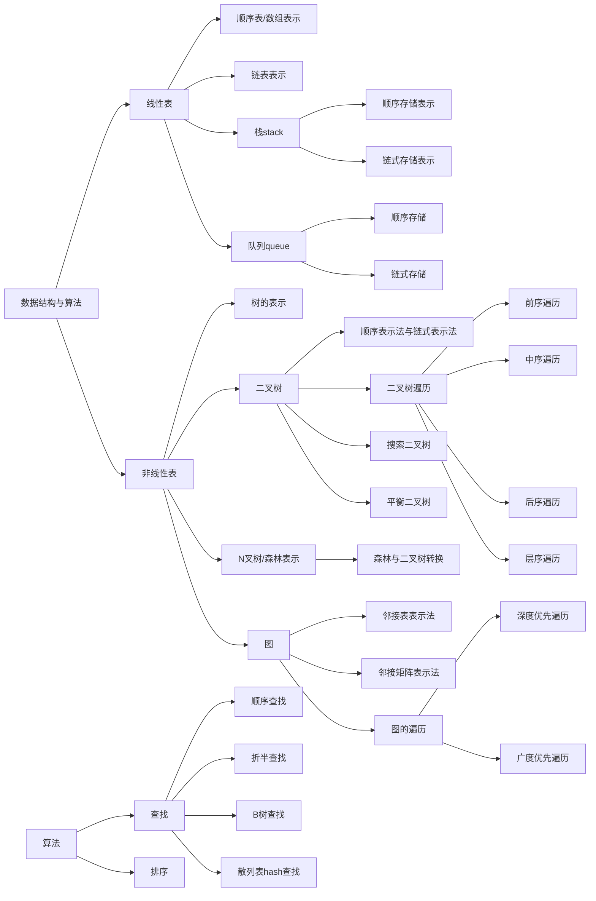

#### 阅读的建议
&nbsp;&nbsp;&nbsp;&nbsp;hello讲解的更系统一点，可以让一开始不知道的小白可以清晰的知道算法的框架是什么，而且他的源码写的也能在本地运行，且代码相对来说写的也不错，很有参考的价值。比如会有工具类的意识等等。

&nbsp;&nbsp;&nbsp;&nbsp;labuladong的算法小抄，就如起的名字一样，就是学了大课之后还得要快速练习掌握，这个就很有帮助了。不过不建议一上来就练习，要不然会废掉。不过最近网站也丰富了许多，也是比较值得学习的。还有30天付费打开挑战。

&nbsp;&nbsp;&nbsp;&nbsp;最后一个是leetcode的100道热题，其实和labuladong 算法题又重复，但是这里提出来是想说要时常刷刷其中的题。

&nbsp;&nbsp;&nbsp;&nbsp;最后总结一下，其实上面这些都看一遍的话足够了。重点是刷题。不过怎么刷题是个考究的。横冲直撞不过师傅带教。慢慢来。

| 参考连接                                  | 名称               |
|:---------------------------------------------|:-------------------|
| https://github.com/krahets/hello-algo/       | hello算法          |
| https://labuladong.online/zh/roadmap/        | labuladong算法小抄 |
| https://leetcode.cn/studyplan/top-100-liked/ | leetcode百题挑战   |

#### 命名规范：
&nbsp;&nbsp;&nbsp;&nbsp;&nbsp;&nbsp;这里的命名规范是为了git 能展现思维导图的功能。分为两个部分：
一是：git 提交的commit 规范，主要参考的是 [convertional commits](https://www.conventionalcommits.org/en/v1.0.0/) ; [gitemoji](https://gitmoji.dev)
编写的commit语句参考如下：

:wrench: chore: standardize directory and file naming

conventional commits 和gitemoji一起编辑更好，如下所示：
| Conventional Type | 推荐 Gitmoji | Emoji | 说明 |
|-------------------|-------------|------|------|
| `feat`            | `:sparkles:` | ✨   | 新功能（最常用） |
| `fix`             | `:bug:`      | 🐞   | Bug 修复 |
| `docs`            | `:memo:`     | 📝   | 文档更新 |
| `style`           | `:art:`      | 🎨   | 代码格式、空格、分号等（不改变逻辑） |
| `refactor`        | `:recycle:`  | ♻️   | 重构（既非 feat 也非 fix） |
| `perf`            | `:zap:`      | ⚡   | 性能优化 |
| `test`            | `:white_check_mark:` | ✅ | 添加/修改测试 |
| `build`           | `:package:`  | 📦   | 构建系统、依赖变更 |
| `ci`              | `:green_heart:` | 💚 | CI 配置（GitHub Actions, Jenkins 等） |
| `chore`           | `:wrench:`   | 🔧   | 杂项维护（目录整理、脚本调整等） |
| `revert`          | `:rewind:`   | ⏪   | 回滚提交 |

二是文件的命令规范：
参考本文件夹中的文件和文件夹的命名；

#### 常用数据结构与算法思维导图

持续更新中

