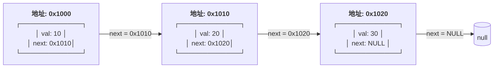
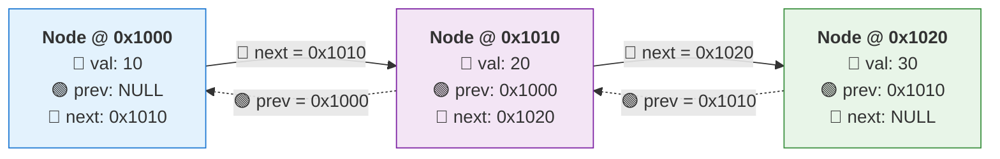
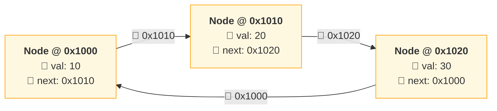

### 链表对比表：
| 链表类型     | 节点地址 | `prev`   | `val` | `next`   | 尾节点特征      |
| ------------ | -------- | -------- | ----- | -------- | --------------- |
| **单向链表** | `0x1000` | —        | `10`  | `0x1010` | `next = NULL`   |
|              | `0x1010` | —        | `20`  | `0x1020` |                 |
|              | `0x1020` | —        | `30`  | `NULL`   | ← 尾节点        |
| **双向链表** | `0x2000` | `NULL`   | `10`  | `0x2010` | `next = NULL`   |
|              | `0x2010` | `0x2000` | `20`  | `0x2020` |                 |
|              | `0x2020` | `0x2010` | `30`  | `NULL`   | ← 尾节点        |
| **循环链表** | `0x3000` | —        | `10`  | `0x3010` | `next = 头地址` |
|              | `0x3010` | —        | `20`  | `0x3020` |                 |
|              | `0x3020` | —        | `30`  | `0x3000` | ← 指回 `0x3000` |

#### 单链表链表的储存结构：

#### 双向链表

#### 循环链表

### 链表类型内存与结构对比
| 对比项             | 单向链表                            | 双向链表                                         | 单向循环链表         | 双向循环链表                               |
| ------------------ | ----------------------------------- | ------------------------------------------------ | -------------------- | ------------------------------------------ |
| **节点包含字段**   | `val`, `next`                       | `val`, `prev`, `next`                            | `val`, `next`        | `val`, `prev`, `next`                      |
| **是否有 `prev`**  | 否                                  | 是                                               | 否                   | 是                                         |
| **典型节点大小**   | 16 字节                             | 24 字节                                          | 16 字节              | 24 字节                                    |
| **内存组成**       | `int(4B)` + 填充`(4B)` + `next(8B)` | `int(4B)` + 填充`(4B)` + `prev(8B)` + `next(8B)` | 同单向链表           | 同双向链表                                 |
| **头节点 `prev`**  | 无                                  | `NULL`                                           | 无                   | 指向**尾节点地址**                         |
| **尾节点 `next`**  | `NULL`                              | `NULL`                                           | 指向**头节点地址**   | 指向**头节点地址**                         |
| **是否可反向遍历** | 否                                  | 是                                               | 否                   | 是                                         |
| **示例尾节点特征** | `next = NULL`                       | `next = NULL`                                    | `next = 0x1000`      | `next = 0x1000`, `prev = 0x1010`           |
| **适用场景**       | 栈、简单队列                        | LRU 缓存、浏览器历史                             | 轮询调度、约瑟夫问题 | 需要双向遍历且循环的场景（如播放列表循环） |

### 链表方法总结：

| 方法                    | 核心使用技巧                      | 应用范围（看到什么题就用）       | 局限 / 注意点                      | 经典题目 & 代码                                                                                                                                            |
| ----------------------- | --------------------------------- | -------------------------------- | ---------------------------------- | ---------------------------------------------------------------------------------------------------------------------------------------------------------- |
| **迭代（遍历）**        | `cur = cur->next` 顺序扫描        | 统计、查找、简单删除、不改变结构 | 无法回头；复杂逻辑容易写成 if 地狱 | [LC203](https://leetcode.com/problems/remove-linked-list-elements/)、[代码](https://leetcode.com/problems/remove-linked-list-elements/solutions/)          |
| **递归**                | 把问题交给 `next`，利用回溯改指针 | 反转、合并、成对交换             | 栈深度大；不适合超长链表           | [LC206](https://leetcode.com/problems/reverse-linked-list/)、[代码](https://leetcode.com/problems/reverse-linked-list/solutions/)                          |
| **快慢指针**            | `fast` 走两步，`slow` 走一步      | 中点、是否有环                   | 不适合修改结构                     | [LC876](https://leetcode.com/problems/middle-of-the-linked-list/)、[代码](https://leetcode.com/problems/middle-of-the-linked-list/solutions/)              |
| **前后双指针**          | 先拉开距离，再同步移动            | 倒数第 N 个节点                  | 必须处理边界（N = 长度）           | [LC19](https://leetcode.com/problems/remove-nth-node-from-end-of-list/)、[代码](https://leetcode.com/problems/remove-nth-node-from-end-of-list/solutions/) |
| **环检测（Floyd）**     | 快慢指针相遇                      | 是否有环、找环入口               | 只能用于单向链表                   | [LC141](https://leetcode.com/problems/linked-list-cycle/)、[LC142](https://leetcode.com/problems/linked-list-cycle-ii/)                                    |
| **虚拟头结点（Dummy）** | 统一“删除头节点”逻辑              | 删除、插入、重排                 | 多一个节点，需理解指针             | [LC203](https://leetcode.com/problems/remove-linked-list-elements/)                                                                                        |
| **链表反转（迭代）**    | `prev / cur / next` 三指针        | 区间反转、K 组反转               | 指针顺序易写错                     | [LC206](https://leetcode.com/problems/reverse-linked-list/)                                                                                                |
| **区间反转**            | 找区间前驱 + 局部反转             | 局部结构变化                     | 实现复杂，易越界                   | [LC92](https://leetcode.com/problems/reverse-linked-list-ii/)                                                                                              |
| **K 组反转**            | 分组 + 局部反转                   | 高频面试题                       | 逻辑复杂                           | [LC25](https://leetcode.com/problems/reverse-nodes-in-k-group/)                                                                                            |
| **分治 / 归并**         | 拆成子链表再合并                  | 排序、合并多个链表               | 实现偏重                           | [LC21](https://leetcode.com/problems/merge-two-sorted-lists/)、[LC23](https://leetcode.com/problems/merge-k-sorted-lists/)                                 |
| **链表排序**            | 归并排序（找中点）                | O(n log n) 排序                  | 代码长                             | [LC148](https://leetcode.com/problems/sort-list/)                                                                                                          |
